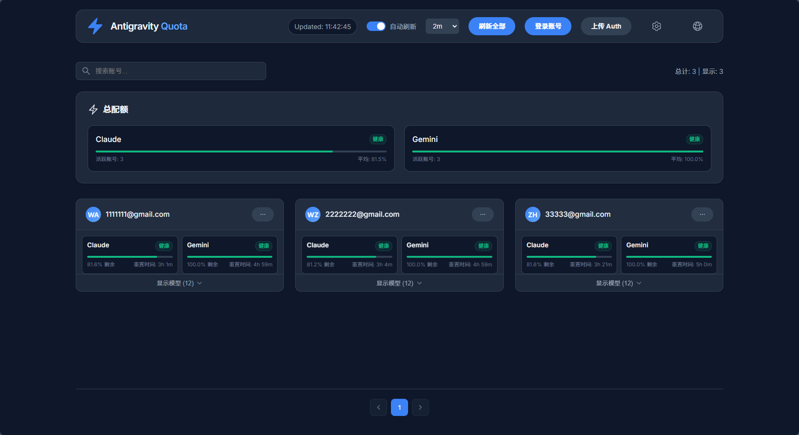

# Antigravity Quota Web Panel

[English](README_EN.md) | 中文

实时监控 Antigravity 模型使用配额的 Web 面板。

## 预览



## 功能特点

- 📊 **实时监控** - 查看所有模型的剩余配额百分比
- ⏰ **重置时间** - 显示配额重置倒计时
- 🔄 **自动刷新** - 可选择刷新间隔（30秒/1分钟/2分钟/5分钟/10分钟）
- 👥 **多账号支持** - 同时监控多个 Antigravity 账号
- 🔐 **自动Token刷新** - 自动使用 refresh_token 更新过期的 access_token
- 📤 **便捷上传** - 通过 Web 界面直接上传 auth JSON 文件
- 🔗 **兼容 CLIProxyAPI** - 可直接使用 CLIProxyAPI 的 auth 文件，无需转换
- 🌐 **代理支持** - 支持 HTTP/SOCKS5/SOCKS4 代理，可通过界面配置
- 🌍 **中英文切换** - 支持中英文界面切换
- 🐳 **Docker 支持** - 支持 Docker 容器化部署

## 安装

### 方式一：本地运行

```bash
# 进入项目目录
cd antigravity-quota-web

# 安装依赖
npm install

# 启动服务器
npm start
```

### 方式二：Docker 部署（推荐）

```bash
# 进入项目目录
cd antigravity-quota-web

# 构建并启动容器
docker-compose up -d

# 查看日志
docker-compose logs -f

# 停止服务
docker-compose down

# 重新构建（代码更新后）
docker-compose up -d --build
```

或者使用 Docker 命令直接运行：

```bash
# 构建镜像
docker build -t antigravity-quota-web .

# 运行容器
docker run -d \
  --name antigravity-quota-web \
  -p 3078:3078 \
  -v $(pwd)/config:/app/config \
  --restart unless-stopped \
  antigravity-quota-web
```

## 使用方法

### 1. 添加 Auth 文件

将你的 Antigravity auth JSON 文件复制到 `config` 目录：

```bash
# 创建 config 目录
mkdir -p config

# 复制 auth 文件
cp /path/to/antigravity-yourname.json config/
```

Auth 文件格式示例：
```json
{
  "access_token": "ya29.xxx...",
  "refresh_token": "1//xxx...",
  "email": "user@gmail.com",
  "expires_in": 3599,
  "timestamp": 1702500000000,
  "type": "antigravity"
}
```

### 2. 启动服务器

```bash
# 本地运行
npm start

# 或 Docker 运行
docker-compose up -d
```

服务器默认运行在 http://localhost:3078

### 3. 访问 Web 面板

打开浏览器访问 http://localhost:3078

### 4. 配置代理（可选）

如果需要通过代理访问 Google API，可以：

1. 点击页面右上角的 ⚙️ 齿轮图标
2. 启用代理并选择代理类型（HTTP/SOCKS5/SOCKS4）
3. 输入代理地址，例如：
   - HTTP 代理：`127.0.0.1:7890`
   - SOCKS5 代理：`127.0.0.1:7891`
4. 点击「测试」验证连接
5. 点击「保存」应用设置

代理配置会保存到 `config/proxy.json`，重启后自动加载。

## API 接口

| 接口 | 方法 | 说明 |
|------|------|------|
| `/api/accounts` | GET | 获取所有账号列表 |
| `/api/quota` | GET | 获取所有账号的配额信息 |
| `/api/quota/:email` | GET | 获取指定账号的配额信息 |
| `/api/refresh/:email` | POST | 刷新指定账号的 Token |
| `/api/upload` | POST | 上传新的 auth 文件 |
| `/api/proxy` | GET | 获取代理配置 |
| `/api/proxy` | POST | 保存代理配置 |
| `/api/proxy/test` | POST | 测试代理连接 |
| `/api/health` | GET | 健康检查 |

## 配置

可以通过环境变量配置：

| 变量 | 默认值 | 说明 |
|------|--------|------|
| `PORT` | 3078 | 服务器端口 |
| `CONFIG_DIR` | ./config | auth 文件存放目录 |
| `HTTPS_PROXY` | - | HTTP(S) 代理地址（备用，优先使用界面配置） |

示例：
```bash
# 本地运行
PORT=8080 CONFIG_DIR=/data/auth npm start

# Docker 运行（修改 docker-compose.yml 中的环境变量）
```

## Docker 配置说明

`docker-compose.yml` 配置项：

| 配置项 | 说明 |
|--------|------|
| `ports: "3078:3078"` | 端口映射，可修改为其他端口如 `"8080:3078"` |
| `volumes: ./config:/app/config` | 配置目录挂载，用于持久化 auth 文件和代理配置 |
| `restart: unless-stopped` | 容器异常退出时自动重启 |
| `healthcheck` | 健康检查，确保服务正常运行 |

## 项目结构

```
antigravity-quota-web/
├── package.json          # 项目配置
├── README.md             # 说明文档
├── Dockerfile            # Docker 镜像构建文件
├── docker-compose.yml    # Docker Compose 配置
├── .dockerignore         # Docker 构建忽略文件
├── src/
│   ├── index.js          # 主入口/Web服务器
│   ├── auth.js           # Token 刷新和代理逻辑
│   └── quota.js          # 配额查询逻辑
├── public/
│   ├── index.html        # Web 界面
│   ├── style.css         # 样式
│   └── app.js            # 前端脚本
└── config/               # 配置文件存放目录
    ├── antigravity-*.json  # auth 文件
    └── proxy.json          # 代理配置（自动生成）
```

## 状态指示

| 图标 | 状态 | 说明 |
|------|------|------|
| 🟢 | 充足 | 剩余配额 ≥ 50% |
| 🟡 | 中等 | 剩余配额 30%-50% |
| 🔴 | 不足 | 剩余配额 < 30% |
| ⚫ | 耗尽 | 配额已用完 |
| ⚪ | 未知 | 无法获取配额信息 |

## 注意事项

1. **安全性**: 此工具仅供本地或内网使用，请勿暴露到公网
2. **Token 安全**: auth 文件包含敏感凭证，请妥善保管
3. **API 限制**: 请勿频繁刷新，以免触发 Google API 限制
4. **Docker 权限**: 确保 config 目录对容器有读写权限
5. **代理配置**: 代理设置保存在 config/proxy.json，会在服务重启后自动加载

## 许可证

MIT License
